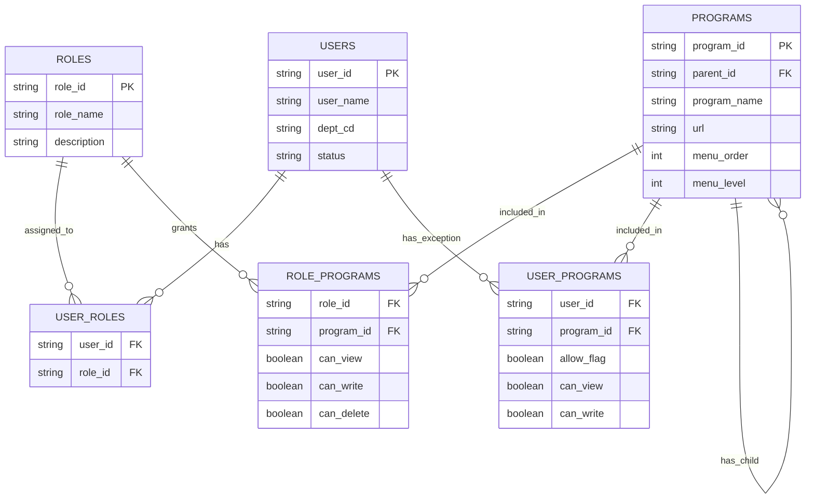
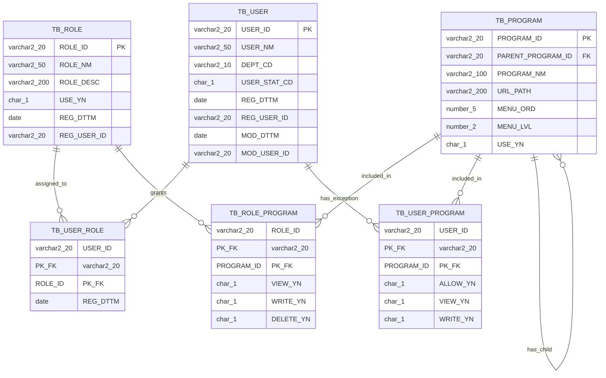

# 권한관리(RBAC) 논리 모델 및 메인 메뉴 구조

업무용 웹 애플리케이션 프레임워크의 공통 모듈 중 하나인 **로그인 사용자 권한별 메뉴 노출 구조**에 대한 설계 내용이다.

## 1. 설계 개요

사용자는 하나 이상의 역할(Role)을 가지며, 역할 단위로 프로그램(메뉴)에 대한 조회/등록/삭제 권한을 부여받는다. 역할 기반 권한과 별개로, 특정 사용자에게만 예외적으로 권한을 추가하거나 차단해야 하는 경우를 위해 사용자별 프로그램 예외 테이블을 둔다.

로그인 시 최종 메뉴는 다음 순서로 계산한다.

1. `USER_ROLES`로 사용자가 보유한 역할 목록을 조회한다.
2. `ROLE_PROGRAMS`에서 해당 역할들이 접근 가능한 프로그램(메뉴) 목록과 권한을 가져온다.
3. `USER_PROGRAMS`에 사용자 개별 예외가 있으면 이를 덮어써서 최종 메뉴/권한을 확정한다.
4. 권한이 없는 메뉴는 화면에 아예 렌더링하지 않는다.

## 2. 논리 모델 (ERD)



## 3. 물리 모델 (ERD)

논리 모델을 실제 DB(Oracle 기준)에 구현하기 위한 물리 모델이다. 테이블은 `TB_` 접두어를 사용하고, boolean 컬럼은 `CHAR(1)` (`Y`/`N`) 타입으로, 감사(Audit)를 위한 등록/수정 정보 컬럼을 추가로 둔다.



### 3.1 논리-물리 매핑

| 논리 엔터티 / 속성 | 물리 테이블 / 컬럼 | 자료형 | 비고 |
|---|---|---|---|
| USERS | TB_USER | | 사용자 |
| ㄴ user_id (PK) | USER_ID | VARCHAR2(20) | |
| ㄴ user_name | USER_NM | VARCHAR2(50) | |
| ㄴ dept_cd | DEPT_CD | VARCHAR2(10) | |
| ㄴ status | USER_STAT_CD | CHAR(1) | 1:재직, 2:퇴직 등 코드값 |
| (신규) | REG_DTTM / REG_USER_ID | DATE / VARCHAR2(20) | 등록 감사 컬럼 |
| (신규) | MOD_DTTM / MOD_USER_ID | DATE / VARCHAR2(20) | 수정 감사 컬럼 |
| ROLES | TB_ROLE | | 역할 |
| ㄴ role_id (PK) | ROLE_ID | VARCHAR2(20) | |
| ㄴ role_name | ROLE_NM | VARCHAR2(50) | |
| ㄴ description | ROLE_DESC | VARCHAR2(200) | |
| (신규) | USE_YN | CHAR(1) | 사용여부(Y/N), 기본값 'Y' |
| USER_ROLES | TB_USER_ROLE | | 사용자-역할 매핑 |
| ㄴ user_id (FK) | USER_ID | VARCHAR2(20) | 복합 PK(1) + FK |
| ㄴ role_id (FK) | ROLE_ID | VARCHAR2(20) | 복합 PK(2) + FK |
| PROGRAMS | TB_PROGRAM | | 프로그램/메뉴 |
| ㄴ program_id (PK) | PROGRAM_ID | VARCHAR2(20) | |
| ㄴ parent_id (FK) | PARENT_PROGRAM_ID | VARCHAR2(20) | self FK |
| ㄴ program_name | PROGRAM_NM | VARCHAR2(100) | |
| ㄴ url | URL_PATH | VARCHAR2(200) | |
| ㄴ menu_order | MENU_ORD | NUMBER(5) | |
| ㄴ menu_level | MENU_LVL | NUMBER(2) | |
| (신규) | USE_YN | CHAR(1) | 메뉴 사용여부 |
| ROLE_PROGRAMS | TB_ROLE_PROGRAM | | 역할별 프로그램 권한 |
| ㄴ role_id (FK) | ROLE_ID | VARCHAR2(20) | 복합 PK(1) + FK |
| ㄴ program_id (FK) | PROGRAM_ID | VARCHAR2(20) | 복합 PK(2) + FK |
| ㄴ can_view | VIEW_YN | CHAR(1) | boolean → Y/N |
| ㄴ can_write | WRITE_YN | CHAR(1) | boolean → Y/N |
| ㄴ can_delete | DELETE_YN | CHAR(1) | boolean → Y/N |
| USER_PROGRAMS | TB_USER_PROGRAM | | 사용자별 프로그램 예외 |
| ㄴ user_id (FK) | USER_ID | VARCHAR2(20) | 복합 PK(1) + FK |
| ㄴ program_id (FK) | PROGRAM_ID | VARCHAR2(20) | 복합 PK(2) + FK |
| ㄴ allow_flag | ALLOW_YN | CHAR(1) | boolean → Y/N |
| ㄴ can_view | VIEW_YN | CHAR(1) | boolean → Y/N |
| ㄴ can_write | WRITE_YN | CHAR(1) | boolean → Y/N |

- boolean 속성은 물리 모델에서 `CHAR(1)` (`Y`/`N`) 컬럼으로 변환한다.
- `USERS`, `ROLES`, `PROGRAMS`에는 논리 모델에 없던 `USE_YN`(사용여부) 및 `REG_DTTM`/`REG_USER_ID`/`MOD_DTTM`/`MOD_USER_ID`(등록·수정 감사 컬럼)를 물리 모델에서 추가한다.
- 복합키(PK+FK)로 표기된 컬럼은 매핑 테이블/예외 테이블에서 두 컬럼이 함께 PK를 구성한다.

## 4. 테이블 정의

### 4.1 USERS (사용자)

| 컬럼 | 설명 |
|------|------|
| user_id (PK) | 사용자 ID |
| user_name | 사용자명 |
| dept_cd | 부서 코드 |
| status | 사용자 상태 (재직/퇴직 등) |

### 4.2 ROLES (역할)

| 컬럼 | 설명 |
|------|------|
| role_id (PK) | 역할 ID |
| role_name | 역할명 (예: 시스템관리자, 일반사용자) |
| description | 역할 설명 |

### 4.3 USER_ROLES (사용자-역할 매핑)

| 컬럼 | 설명 |
|------|------|
| user_id (FK) | 사용자 ID |
| role_id (FK) | 역할 ID |

- 사용자 1명이 여러 역할을 가질 수 있는 N:M 관계

### 4.4 PROGRAMS (프로그램/메뉴)

| 컬럼 | 설명 |
|------|------|
| program_id (PK) | 프로그램(메뉴) ID |
| parent_id (FK, self) | 상위 메뉴 ID (대메뉴-소메뉴 계층 표현) |
| program_name | 메뉴명 |
| url | 연결 URL/라우팅 경로 |
| menu_order | 메뉴 정렬 순서 |
| menu_level | 메뉴 depth (1: 대메뉴, 2: 소메뉴 …) |

### 4.5 ROLE_PROGRAMS (역할별 프로그램 권한)

| 컬럼 | 설명 |
|------|------|
| role_id (FK) | 역할 ID |
| program_id (FK) | 프로그램 ID |
| can_view | 조회 권한 여부 |
| can_write | 등록/수정 권한 여부 |
| can_delete | 삭제 권한 여부 |

- 로그인 시 메뉴 렌더링의 **기본 소스**가 되는 테이블

### 4.6 USER_PROGRAMS (사용자별 프로그램 예외 권한)

| 컬럼 | 설명 |
|------|------|
| user_id (FK) | 사용자 ID |
| program_id (FK) | 프로그램 ID |
| allow_flag | 허용(true) / 차단(false) 구분 |
| can_view | 조회 권한 여부 |
| can_write | 등록/수정 권한 여부 |

- 역할 권한과 별개로 특정 사용자에게만 권한을 추가하거나 회수할 때 사용
- `allow_flag = false`인 경우, 역할 권한상 접근 가능하더라도 해당 사용자는 접근 차단

## 5. 메인 메뉴 화면 예시 (로그인 후)

권한관리 메뉴 항목 예시: **사용자관리, 프로그램관리, Role관리, Role별 프로그램, 사용자별 프로그램**

### 5.1 시스템관리자로 로그인한 경우

```
사내 업무 포털                                    홍길동 (시스템관리자)
─────────────────────────────────────────────────────────
[대시보드]
[업무관리]
[권한관리]  ▼
    ├─ 사용자관리        ← 현재 화면
    ├─ 프로그램관리
    ├─ Role관리
    ├─ Role별 프로그램
    └─ 사용자별 프로그램
[통계/리포트]
```

- `ROLE_PROGRAMS`에 "시스템관리자" role_id로 권한관리 하위 5개 프로그램이 모두 can_view=true로 등록되어 있어 전체 하위 메뉴가 노출된다.

### 5.2 일반사용자로 로그인한 경우

```
사내 업무 포털                                    김철수 (일반사용자)
─────────────────────────────────────────────────────────
[대시보드]
[업무관리]
[통계/리포트]
```

- "일반사용자" role_id로는 `ROLE_PROGRAMS`에 권한관리 관련 프로그램이 등록되어 있지 않으므로, 메뉴 렌더링 로직에서 **권한관리 메뉴 자체가 표시되지 않는다.**
- 만약 특정 일반사용자에게만 "사용자관리" 조회 권한을 추가로 부여하고 싶다면, `USER_PROGRAMS`에 해당 user_id + program_id로 allow_flag=true, can_view=true 레코드를 추가하면 된다.

## 6. 메뉴 렌더링 로직 (의사 코드)

```
1. userRoles = SELECT role_id FROM USER_ROLES WHERE user_id = :login_user
2. baseMenus = SELECT program_id, can_view, can_write, can_delete
               FROM ROLE_PROGRAMS
               WHERE role_id IN (:userRoles)
3. exceptions = SELECT program_id, allow_flag, can_view, can_write
                FROM USER_PROGRAMS
                WHERE user_id = :login_user
4. finalMenus = baseMenus를 exceptions로 덮어쓰기
                (allow_flag = false 인 program_id는 최종 메뉴에서 제외)
5. finalMenus를 PROGRAMS.parent_id 기준으로 트리 구조로 조립하여 화면에 렌더링
```
