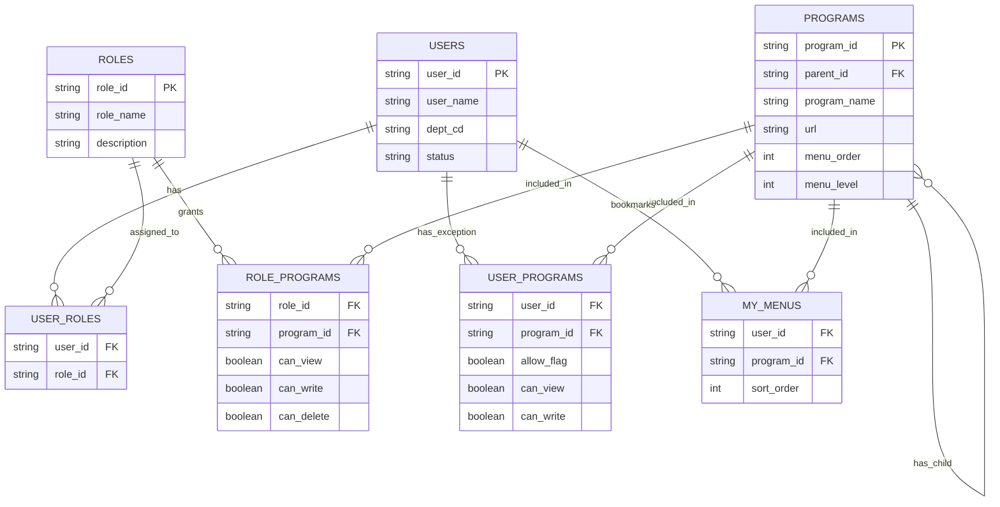

# 권한관리(RBAC) 논리 모델 및 메인 메뉴 구조

업무용 웹 애플리케이션 프레임워크의 공통 모듈 중 하나인 **로그인 사용자 권한별 메뉴 노출 구조**에 대한 설계 내용이다.

## 1. 설계 개요

사용자는 하나 이상의 역할(Role)을 가지며, 역할 단위로 프로그램(메뉴)에 대한 조회/등록/삭제 권한을 부여받는다. 역할 기반 권한과 별개로, 특정 사용자에게만 예외적으로 권한을 추가하거나 차단해야 하는 경우를 위해 사용자별 프로그램 예외 테이블을 둔다.

로그인 시 최종 메뉴는 다음 순서로 계산한다.

1. `USER_ROLES`로 사용자가 보유한 역할 목록을 조회한다.
2. `ROLE_PROGRAMS`에서 해당 역할들이 접근 가능한 프로그램(메뉴) 목록과 권한을 가져온다.
3. `USER_PROGRAMS`에 사용자 개별 예외가 있으면 이를 덮어써서 최종 메뉴/권한을 확정한다.
4. 권한이 없는 메뉴는 화면에 아예 렌더링하지 않는다.

## 2. 논리 모델 (ERD)



## 3. 물리 모델 (ERD)

논리 모델을 실제 DB(MariaDB 기준)에 구현하기 위한 물리 모델이다. 테이블은 `TB_` 접두어를 사용하고, `ENGINE=InnoDB`, `CHARACTER SET utf8mb4`를 기본으로 한다. boolean 컬럼은 `CHAR(1)` (`Y`/`N`) 타입으로, 감사(Audit)를 위한 등록/수정 정보 컬럼을 추가로 둔다.

```mermaid
erDiagram
  TB_USER ||--o{ TB_USER_ROLE : has
  TB_ROLE ||--o{ TB_USER_ROLE : assigned_to
  TB_ROLE ||--o{ TB_ROLE_PROGRAM : grants
  TB_PROGRAM ||--o{ TB_ROLE_PROGRAM : included_in
  TB_USER ||--o{ TB_USER_PROGRAM : has_exception
  TB_PROGRAM ||--o{ TB_USER_PROGRAM : included_in
  TB_PROGRAM ||--o{ TB_PROGRAM : has_child
  TB_USER ||--o{ TB_MY_MENU : bookmarks
  TB_PROGRAM ||--o{ TB_MY_MENU : included_in

  TB_USER {
    varchar_20 USER_ID PK
    varchar_50 USER_NM
    varchar_10 DEPT_CD
    char_1 USER_STAT_CD
    datetime REG_DTTM
    varchar_20 REG_USER_ID
    datetime MOD_DTTM
    varchar_20 MOD_USER_ID
  }
  TB_ROLE {
    varchar_20 ROLE_ID PK
    varchar_50 ROLE_NM
    varchar_200 ROLE_DESC
    char_1 USE_YN
    datetime REG_DTTM
    varchar_20 REG_USER_ID
    datetime MOD_DTTM
    varchar_20 MOD_USER_ID
  }
  TB_USER_ROLE {
    varchar_20 USER_ID PK_FK
    varchar_20 ROLE_ID PK_FK
    datetime REG_DTTM
    varchar_20 REG_USER_ID
    datetime MOD_DTTM
    varchar_20 MOD_USER_ID
  }
  TB_PROGRAM {
    varchar_20 PROGRAM_ID PK
    varchar_20 PARENT_PROGRAM_ID FK
    varchar_100 PROGRAM_NM
    varchar_200 URL_PATH
    int MENU_ORD
    tinyint MENU_LVL
    char_1 USE_YN
    datetime REG_DTTM
    varchar_20 REG_USER_ID
    datetime MOD_DTTM
    varchar_20 MOD_USER_ID
  }
  TB_ROLE_PROGRAM {
    varchar_20 ROLE_ID PK_FK
    varchar_20 PROGRAM_ID PK_FK
    char_1 VIEW_YN
    char_1 WRITE_YN
    char_1 DELETE_YN
    datetime REG_DTTM
    varchar_20 REG_USER_ID
    datetime MOD_DTTM
    varchar_20 MOD_USER_ID
  }
  TB_USER_PROGRAM {
    varchar_20 USER_ID PK_FK
    varchar_20 PROGRAM_ID PK_FK
    char_1 ALLOW_YN
    char_1 VIEW_YN
    char_1 WRITE_YN
    datetime REG_DTTM
    varchar_20 REG_USER_ID
    datetime MOD_DTTM
    varchar_20 MOD_USER_ID
  }
  TB_MY_MENU {
    varchar_20 USER_ID PK_FK
    varchar_20 PROGRAM_ID PK_FK
    int SORT_ORD
    datetime REG_DTTM
    varchar_20 REG_USER_ID
    datetime MOD_DTTM
    varchar_20 MOD_USER_ID
  }
```



### 3.1 논리-물리 매핑

| 논리 엔터티 / 속성 | 물리 테이블 / 컬럼 | 자료형 | 비고 |
|---|---|---|---|
| USERS | TB_USER | | 사용자 |
| ㄴ user_id (PK) | USER_ID | VARCHAR(20) | |
| ㄴ user_name | USER_NM | VARCHAR(50) | |
| ㄴ dept_cd | DEPT_CD | VARCHAR(10) | |
| ㄴ status | USER_STAT_CD | CHAR(1) | 1:재직, 2:퇴직 등 코드값 |
| (신규) | REG_DTTM / REG_USER_ID | DATETIME / VARCHAR(20) | 등록 감사 컬럼, REG_DTTM 기본값 `CURRENT_TIMESTAMP` |
| (신규) | MOD_DTTM / MOD_USER_ID | DATETIME / VARCHAR(20) | 수정 감사 컬럼, MOD_DTTM `ON UPDATE CURRENT_TIMESTAMP` |
| ROLES | TB_ROLE | | 역할 |
| ㄴ role_id (PK) | ROLE_ID | VARCHAR(20) | |
| ㄴ role_name | ROLE_NM | VARCHAR(50) | |
| ㄴ description | ROLE_DESC | VARCHAR(200) | |
| (신규) | USE_YN | CHAR(1) | 사용여부(Y/N), 기본값 'Y' |
| (신규) | REG_DTTM / REG_USER_ID | DATETIME / VARCHAR(20) | 등록 감사 컬럼 |
| (신규) | MOD_DTTM / MOD_USER_ID | DATETIME / VARCHAR(20) | 수정 감사 컬럼 |
| USER_ROLES | TB_USER_ROLE | | 사용자-역할 매핑 |
| ㄴ user_id (FK) | USER_ID | VARCHAR(20) | 복합 PK(1) + FK |
| ㄴ role_id (FK) | ROLE_ID | VARCHAR(20) | 복합 PK(2) + FK |
| (신규) | REG_DTTM / REG_USER_ID | DATETIME / VARCHAR(20) | 등록 감사 컬럼 |
| (신규) | MOD_DTTM / MOD_USER_ID | DATETIME / VARCHAR(20) | 수정 감사 컬럼 |
| PROGRAMS | TB_PROGRAM | | 프로그램/메뉴 |
| ㄴ program_id (PK) | PROGRAM_ID | VARCHAR(20) | |
| ㄴ parent_id (FK) | PARENT_PROGRAM_ID | VARCHAR(20) | self FK |
| ㄴ program_name | PROGRAM_NM | VARCHAR(100) | |
| ㄴ url | URL_PATH | VARCHAR(200) | |
| ㄴ menu_order | MENU_ORD | INT | |
| ㄴ menu_level | MENU_LVL | TINYINT | |
| (신규) | USE_YN | CHAR(1) | 메뉴 사용여부 |
| (신규) | REG_DTTM / REG_USER_ID | DATETIME / VARCHAR(20) | 등록 감사 컬럼 |
| (신규) | MOD_DTTM / MOD_USER_ID | DATETIME / VARCHAR(20) | 수정 감사 컬럼 |
| ROLE_PROGRAMS | TB_ROLE_PROGRAM | | 역할별 프로그램 권한 |
| ㄴ role_id (FK) | ROLE_ID | VARCHAR(20) | 복합 PK(1) + FK |
| ㄴ program_id (FK) | PROGRAM_ID | VARCHAR(20) | 복합 PK(2) + FK |
| ㄴ can_view | VIEW_YN | CHAR(1) | boolean → Y/N |
| ㄴ can_write | WRITE_YN | CHAR(1) | boolean → Y/N |
| ㄴ can_delete | DELETE_YN | CHAR(1) | boolean → Y/N |
| (신규) | REG_DTTM / REG_USER_ID | DATETIME / VARCHAR(20) | 등록 감사 컬럼 |
| (신규) | MOD_DTTM / MOD_USER_ID | DATETIME / VARCHAR(20) | 수정 감사 컬럼 |
| USER_PROGRAMS | TB_USER_PROGRAM | | 사용자별 프로그램 예외 |
| ㄴ user_id (FK) | USER_ID | VARCHAR(20) | 복합 PK(1) + FK |
| ㄴ program_id (FK) | PROGRAM_ID | VARCHAR(20) | 복합 PK(2) + FK |
| ㄴ allow_flag | ALLOW_YN | CHAR(1) | boolean → Y/N |
| ㄴ can_view | VIEW_YN | CHAR(1) | boolean → Y/N |
| ㄴ can_write | WRITE_YN | CHAR(1) | boolean → Y/N |
| (신규) | REG_DTTM / REG_USER_ID | DATETIME / VARCHAR(20) | 등록 감사 컬럼 |
| (신규) | MOD_DTTM / MOD_USER_ID | DATETIME / VARCHAR(20) | 수정 감사 컬럼 |
| MY_MENUS | TB_MY_MENU | | 나의메뉴(사용자 즐겨찾기 메뉴) |
| ㄴ user_id (FK) | USER_ID | VARCHAR(20) | 복합 PK(1) + FK |
| ㄴ program_id (FK) | PROGRAM_ID | VARCHAR(20) | 복합 PK(2) + FK |
| ㄴ sort_order | SORT_ORD | INT | 나의메뉴 내 표시 순서 |
| (신규) | REG_DTTM / REG_USER_ID | DATETIME / VARCHAR(20) | 등록 감사 컬럼 |
| (신규) | MOD_DTTM / MOD_USER_ID | DATETIME / VARCHAR(20) | 수정 감사 컬럼 |

- boolean 속성은 물리 모델에서 `CHAR(1)` (`Y`/`N`) 컬럼으로 변환한다.
- 모든 물리 테이블(TB_USER, TB_ROLE, TB_USER_ROLE, TB_PROGRAM, TB_ROLE_PROGRAM, TB_USER_PROGRAM, TB_CODE_GROUP, TB_CODE, TB_MY_MENU)에 논리 모델에 없던 `REG_DTTM`/`REG_USER_ID`/`MOD_DTTM`/`MOD_USER_ID`(등록·수정 감사 컬럼)를 공통으로 추가한다. `USERS`, `ROLES`, `PROGRAMS`에는 `USE_YN`(사용여부)도 함께 추가한다.
- 복합키(PK+FK)로 표기된 컬럼은 매핑 테이블/예외 테이블에서 두 컬럼이 함께 PK를 구성한다.
- MariaDB 특성상 Oracle의 `VARCHAR2`는 `VARCHAR`로, `NUMBER(n)`은 값 범위에 맞춰 `INT`/`TINYINT`로, `DATE`(시각 포함)는 `DATETIME`으로 대응한다. `SYSDATE` 대신 컬럼 기본값 `CURRENT_TIMESTAMP` / `ON UPDATE CURRENT_TIMESTAMP`를 사용한다.

### 3.2 DDL 예시 (MariaDB)

테이블/컬럼 COMMENT는 "4. 테이블 정의"의 설명을 그대로 반영했다.

```sql
CREATE TABLE TB_USER (
  USER_ID       VARCHAR(20)  NOT NULL COMMENT '사용자 ID',
  USER_NM       VARCHAR(50)  NOT NULL COMMENT '사용자명',
  DEPT_CD       VARCHAR(10)  NULL     COMMENT '부서 코드',
  USER_STAT_CD  CHAR(1)      NOT NULL COMMENT '사용자 상태 (재직/퇴직 등)',
  REG_DTTM      DATETIME     NOT NULL DEFAULT CURRENT_TIMESTAMP COMMENT '등록일시',
  REG_USER_ID   VARCHAR(20)  NULL     COMMENT '등록자 ID',
  MOD_DTTM      DATETIME     NULL DEFAULT CURRENT_TIMESTAMP ON UPDATE CURRENT_TIMESTAMP COMMENT '수정일시',
  MOD_USER_ID   VARCHAR(20)  NULL     COMMENT '수정자 ID',
  PRIMARY KEY (USER_ID)
) ENGINE=InnoDB DEFAULT CHARSET=utf8mb4 COMMENT='사용자';

CREATE TABLE TB_ROLE (
  ROLE_ID     VARCHAR(20)  NOT NULL COMMENT '역할 ID',
  ROLE_NM     VARCHAR(50)  NOT NULL COMMENT '역할명 (예: 시스템관리자, 일반사용자)',
  ROLE_DESC   VARCHAR(200) NULL     COMMENT '역할 설명',
  USE_YN      CHAR(1)      NOT NULL DEFAULT 'Y' COMMENT '사용여부 (Y/N)',
  REG_DTTM    DATETIME     NOT NULL DEFAULT CURRENT_TIMESTAMP COMMENT '등록일시',
  REG_USER_ID VARCHAR(20)  NULL     COMMENT '등록자 ID',
  MOD_DTTM    DATETIME     NULL DEFAULT CURRENT_TIMESTAMP ON UPDATE CURRENT_TIMESTAMP COMMENT '수정일시',
  MOD_USER_ID VARCHAR(20)  NULL     COMMENT '수정자 ID',
  PRIMARY KEY (ROLE_ID)
) ENGINE=InnoDB DEFAULT CHARSET=utf8mb4 COMMENT='역할';

CREATE TABLE TB_USER_ROLE (
  USER_ID     VARCHAR(20) NOT NULL COMMENT '사용자 ID',
  ROLE_ID     VARCHAR(20) NOT NULL COMMENT '역할 ID',
  REG_DTTM    DATETIME    NOT NULL DEFAULT CURRENT_TIMESTAMP COMMENT '등록일시',
  REG_USER_ID VARCHAR(20) NULL     COMMENT '등록자 ID',
  MOD_DTTM    DATETIME    NULL DEFAULT CURRENT_TIMESTAMP ON UPDATE CURRENT_TIMESTAMP COMMENT '수정일시',
  MOD_USER_ID VARCHAR(20) NULL     COMMENT '수정자 ID',
  PRIMARY KEY (USER_ID, ROLE_ID),
  CONSTRAINT FK_USER_ROLE_USER FOREIGN KEY (USER_ID) REFERENCES TB_USER (USER_ID),
  CONSTRAINT FK_USER_ROLE_ROLE FOREIGN KEY (ROLE_ID) REFERENCES TB_ROLE (ROLE_ID)
) ENGINE=InnoDB DEFAULT CHARSET=utf8mb4 COMMENT='사용자-역할 매핑 (사용자 1명이 여러 역할을 가질 수 있는 N:M 관계)';

CREATE TABLE TB_PROGRAM (
  PROGRAM_ID        VARCHAR(20)  NOT NULL COMMENT '프로그램(메뉴) ID',
  PARENT_PROGRAM_ID VARCHAR(20)  NULL     COMMENT '상위 메뉴 ID (대메뉴-소메뉴 계층 표현)',
  PROGRAM_NM        VARCHAR(100) NOT NULL COMMENT '메뉴명',
  URL_PATH          VARCHAR(200) NULL     COMMENT '연결 URL/라우팅 경로',
  MENU_ORD          INT          NULL     COMMENT '메뉴 정렬 순서',
  MENU_LVL          TINYINT      NULL     COMMENT '메뉴 depth (1: 대메뉴, 2: 소메뉴 …)',
  USE_YN            CHAR(1)      NOT NULL DEFAULT 'Y' COMMENT '메뉴 사용여부 (Y/N)',
  REG_DTTM          DATETIME     NOT NULL DEFAULT CURRENT_TIMESTAMP COMMENT '등록일시',
  REG_USER_ID       VARCHAR(20)  NULL     COMMENT '등록자 ID',
  MOD_DTTM          DATETIME     NULL DEFAULT CURRENT_TIMESTAMP ON UPDATE CURRENT_TIMESTAMP COMMENT '수정일시',
  MOD_USER_ID       VARCHAR(20)  NULL     COMMENT '수정자 ID',
  PRIMARY KEY (PROGRAM_ID),
  CONSTRAINT FK_PROGRAM_PARENT FOREIGN KEY (PARENT_PROGRAM_ID) REFERENCES TB_PROGRAM (PROGRAM_ID)
) ENGINE=InnoDB DEFAULT CHARSET=utf8mb4 COMMENT='프로그램/메뉴';

CREATE TABLE TB_ROLE_PROGRAM (
  ROLE_ID     VARCHAR(20) NOT NULL COMMENT '역할 ID',
  PROGRAM_ID  VARCHAR(20) NOT NULL COMMENT '프로그램 ID',
  VIEW_YN     CHAR(1)     NOT NULL DEFAULT 'N' COMMENT '조회 권한 여부',
  WRITE_YN    CHAR(1)     NOT NULL DEFAULT 'N' COMMENT '등록/수정 권한 여부',
  DELETE_YN   CHAR(1)     NOT NULL DEFAULT 'N' COMMENT '삭제 권한 여부',
  REG_DTTM    DATETIME    NOT NULL DEFAULT CURRENT_TIMESTAMP COMMENT '등록일시',
  REG_USER_ID VARCHAR(20) NULL     COMMENT '등록자 ID',
  MOD_DTTM    DATETIME    NULL DEFAULT CURRENT_TIMESTAMP ON UPDATE CURRENT_TIMESTAMP COMMENT '수정일시',
  MOD_USER_ID VARCHAR(20) NULL     COMMENT '수정자 ID',
  PRIMARY KEY (ROLE_ID, PROGRAM_ID),
  CONSTRAINT FK_ROLE_PROGRAM_ROLE FOREIGN KEY (ROLE_ID) REFERENCES TB_ROLE (ROLE_ID),
  CONSTRAINT FK_ROLE_PROGRAM_PROGRAM FOREIGN KEY (PROGRAM_ID) REFERENCES TB_PROGRAM (PROGRAM_ID)
) ENGINE=InnoDB DEFAULT CHARSET=utf8mb4 COMMENT='역할별 프로그램 권한 (로그인 시 메뉴 렌더링의 기본 소스)';

CREATE TABLE TB_USER_PROGRAM (
  USER_ID     VARCHAR(20) NOT NULL COMMENT '사용자 ID',
  PROGRAM_ID  VARCHAR(20) NOT NULL COMMENT '프로그램 ID',
  ALLOW_YN    CHAR(1)     NOT NULL COMMENT '허용(Y) / 차단(N) 구분',
  VIEW_YN     CHAR(1)     NULL     COMMENT '조회 권한 여부',
  WRITE_YN    CHAR(1)     NULL     COMMENT '등록/수정 권한 여부',
  REG_DTTM    DATETIME    NOT NULL DEFAULT CURRENT_TIMESTAMP COMMENT '등록일시',
  REG_USER_ID VARCHAR(20) NULL     COMMENT '등록자 ID',
  MOD_DTTM    DATETIME    NULL DEFAULT CURRENT_TIMESTAMP ON UPDATE CURRENT_TIMESTAMP COMMENT '수정일시',
  MOD_USER_ID VARCHAR(20) NULL     COMMENT '수정자 ID',
  PRIMARY KEY (USER_ID, PROGRAM_ID),
  CONSTRAINT FK_USER_PROGRAM_USER FOREIGN KEY (USER_ID) REFERENCES TB_USER (USER_ID),
  CONSTRAINT FK_USER_PROGRAM_PROGRAM FOREIGN KEY (PROGRAM_ID) REFERENCES TB_PROGRAM (PROGRAM_ID)
) ENGINE=InnoDB DEFAULT CHARSET=utf8mb4 COMMENT='사용자별 프로그램 예외 권한 (allow_flag가 N이면 역할 권한상 접근 가능해도 해당 사용자는 접근 차단)';

CREATE TABLE TB_MY_MENU (
  USER_ID     VARCHAR(20) NOT NULL COMMENT '사용자 ID',
  PROGRAM_ID  VARCHAR(20) NOT NULL COMMENT '프로그램 ID',
  SORT_ORD    INT         NULL     COMMENT '나의메뉴 내 표시 순서',
  REG_DTTM    DATETIME    NOT NULL DEFAULT CURRENT_TIMESTAMP COMMENT '등록일시',
  REG_USER_ID VARCHAR(20) NULL     COMMENT '등록자 ID',
  MOD_DTTM    DATETIME    NULL DEFAULT CURRENT_TIMESTAMP ON UPDATE CURRENT_TIMESTAMP COMMENT '수정일시',
  MOD_USER_ID VARCHAR(20) NULL     COMMENT '수정자 ID',
  PRIMARY KEY (USER_ID, PROGRAM_ID),
  CONSTRAINT FK_MY_MENU_USER FOREIGN KEY (USER_ID) REFERENCES TB_USER (USER_ID),
  CONSTRAINT FK_MY_MENU_PROGRAM FOREIGN KEY (PROGRAM_ID) REFERENCES TB_PROGRAM (PROGRAM_ID)
) ENGINE=InnoDB DEFAULT CHARSET=utf8mb4 COMMENT='나의메뉴 (사용자가 즐겨찾기로 등록한 프로그램)';
```

## 4. 테이블 정의

### 4.1 USERS (사용자)

| 컬럼 | 설명 |
|------|------|
| user_id (PK) | 사용자 ID |
| user_name | 사용자명 |
| dept_cd | 부서 코드 |
| status | 사용자 상태 (재직/퇴직 등) |

### 4.2 ROLES (역할)

| 컬럼 | 설명 |
|------|------|
| role_id (PK) | 역할 ID |
| role_name | 역할명 (예: 시스템관리자, 일반사용자) |
| description | 역할 설명 |

### 4.3 USER_ROLES (사용자-역할 매핑)

| 컬럼 | 설명 |
|------|------|
| user_id (FK) | 사용자 ID |
| role_id (FK) | 역할 ID |

- 사용자 1명이 여러 역할을 가질 수 있는 N:M 관계

### 4.4 PROGRAMS (프로그램/메뉴)

| 컬럼 | 설명 |
|------|------|
| program_id (PK) | 프로그램(메뉴) ID |
| parent_id (FK, self) | 상위 메뉴 ID (대메뉴-소메뉴 계층 표현) |
| program_name | 메뉴명 |
| url | 연결 URL/라우팅 경로 |
| menu_order | 메뉴 정렬 순서 |
| menu_level | 메뉴 depth (1: 대메뉴, 2: 소메뉴 …) |

### 4.5 ROLE_PROGRAMS (역할별 프로그램 권한)

| 컬럼 | 설명 |
|------|------|
| role_id (FK) | 역할 ID |
| program_id (FK) | 프로그램 ID |
| can_view | 조회 권한 여부 |
| can_write | 등록/수정 권한 여부 |
| can_delete | 삭제 권한 여부 |

- 로그인 시 메뉴 렌더링의 **기본 소스**가 되는 테이블

### 4.6 USER_PROGRAMS (사용자별 프로그램 예외 권한)

| 컬럼 | 설명 |
|------|------|
| user_id (FK) | 사용자 ID |
| program_id (FK) | 프로그램 ID |
| allow_flag | 허용(true) / 차단(false) 구분 |
| can_view | 조회 권한 여부 |
| can_write | 등록/수정 권한 여부 |

- 역할 권한과 별개로 특정 사용자에게만 권한을 추가하거나 회수할 때 사용
- `allow_flag = false`인 경우, 역할 권한상 접근 가능하더라도 해당 사용자는 접근 차단

### 4.7 MY_MENUS (나의메뉴)

| 컬럼 | 설명 |
|------|------|
| user_id (FK) | 사용자 ID |
| program_id (FK) | 프로그램 ID |
| sort_order | 나의메뉴 내 표시 순서 |

- 사용자가 자주 쓰는 프로그램(메뉴)을 개인적으로 즐겨찾기해두는 테이블. 역할/예외 기반 접근 권한(ROLE_PROGRAMS, USER_PROGRAMS)과는 무관하며, 최종적으로 렌더링 권한이 있는 메뉴 중에서만 나의메뉴로 등록/노출하는 것이 일반적이다.

## 5. 메인 메뉴 화면 예시 (로그인 후)

권한관리 메뉴 항목 예시: **사용자관리, 프로그램관리, Role관리, Role별 프로그램, 사용자별 프로그램**

### 5.1 시스템관리자로 로그인한 경우

```
사내 업무 포털                                    홍길동 (시스템관리자)
─────────────────────────────────────────────────────────
[대시보드]
[업무관리]
[권한관리]  ▼
    ├─ 사용자관리        ← 현재 화면
    ├─ 프로그램관리
    ├─ Role관리
    ├─ Role별 프로그램
    └─ 사용자별 프로그램
[통계/리포트]
```

- `ROLE_PROGRAMS`에 "시스템관리자" role_id로 권한관리 하위 5개 프로그램이 모두 can_view=true로 등록되어 있어 전체 하위 메뉴가 노출된다.

### 5.2 일반사용자로 로그인한 경우

```
사내 업무 포털                                    김철수 (일반사용자)
─────────────────────────────────────────────────────────
[대시보드]
[업무관리]
[통계/리포트]
```

- "일반사용자" role_id로는 `ROLE_PROGRAMS`에 권한관리 관련 프로그램이 등록되어 있지 않으므로, 메뉴 렌더링 로직에서 **권한관리 메뉴 자체가 표시되지 않는다.**
- 만약 특정 일반사용자에게만 "사용자관리" 조회 권한을 추가로 부여하고 싶다면, `USER_PROGRAMS`에 해당 user_id + program_id로 allow_flag=true, can_view=true 레코드를 추가하면 된다.

## 6. 메뉴 렌더링 로직 (의사 코드)

```
1. userRoles = SELECT role_id FROM USER_ROLES WHERE user_id = :login_user
2. baseMenus = SELECT program_id, can_view, can_write, can_delete
               FROM ROLE_PROGRAMS
               WHERE role_id IN (:userRoles)
3. exceptions = SELECT program_id, allow_flag, can_view, can_write
                FROM USER_PROGRAMS
                WHERE user_id = :login_user
4. finalMenus = baseMenus를 exceptions로 덮어쓰기
                (allow_flag = false 인 program_id는 최종 메뉴에서 제외)
5. finalMenus를 PROGRAMS.parent_id 기준으로 트리 구조로 조립하여 화면에 렌더링
```

## 7. 공통코드(Common Code) 테이블

기존 테이블의 컬럼 중 정해진 값 집합(코드) 중 하나가 대입되는 항목들을 공통코드 그룹/상세 2단 구조로 뽑아낸다.

### 7.1 대상 컬럼 매핑

| 대상 테이블.컬럼 | 그룹코드(GROUP_CD) | 코드값 예시 |
|---|---|---|
| TB_USER.USER_STAT_CD | USER_STAT | 1(재직), 2(휴직), 3(퇴직) |
| TB_PROGRAM.MENU_LVL | MENU_LVL | 1(대메뉴), 2(소메뉴), 3(세부메뉴) |
| TB_ROLE.USE_YN, TB_PROGRAM.USE_YN, TB_ROLE_PROGRAM.VIEW_YN/WRITE_YN/DELETE_YN, TB_USER_PROGRAM.ALLOW_YN/VIEW_YN/WRITE_YN | YN | Y(사용/허용), N(미사용/차단) |

- `DEPT_CD`(부서 코드)는 값 목록이 아니라 실제 조직(부서) 데이터를 가리키므로, 공통코드가 아닌 별도 부서 마스터 테이블 대상으로 남겨둔다(현재 모델 범위 밖).
- `*_ID`류(USER_ID, ROLE_ID, PROGRAM_ID 등)는 엔터티 식별자이므로 공통코드 대상이 아니다.

### 7.2 ERD

```mermaid
erDiagram
  TB_CODE_GROUP ||--o{ TB_CODE : has

  TB_CODE_GROUP {
    varchar_30 GROUP_CD PK
    varchar_100 GROUP_NM
    varchar_200 GROUP_DESC
    char_1 USE_YN
    datetime REG_DTTM
    varchar_20 REG_USER_ID
    datetime MOD_DTTM
    varchar_20 MOD_USER_ID
  }
  TB_CODE {
    varchar_30 GROUP_CD PK_FK
    varchar_30 CODE PK
    varchar_100 CODE_NM
    varchar_200 CODE_DESC
    int SORT_ORD
    char_1 USE_YN
    datetime REG_DTTM
    varchar_20 REG_USER_ID
    datetime MOD_DTTM
    varchar_20 MOD_USER_ID
  }
```

- `TB_USER.USER_STAT_CD`, `TB_PROGRAM.MENU_LVL`, 각 테이블의 `*_YN` 컬럼은 `TB_CODE.GROUP_CD`(위 7.1 매핑)를 애플리케이션 레벨에서 참조한다. `TB_CODE.CODE`는 여러 그룹이 공유하는 범용 컬럼(VARCHAR)이라 자료형이 다른 `MENU_LVL`(TINYINT) 등과는 DB FK 제약을 걸지 않고, 콤보박스/유효성 검증 등 애플리케이션 로직에서 참조하는 것이 일반적인 공통코드 설계 방식이다.

### 7.3 테이블 정의

#### 7.3.1 TB_CODE_GROUP (공통코드 그룹)

| 컬럼 | 설명 |
|------|------|
| group_cd (PK) | 코드 그룹 ID (예: USER_STAT, MENU_LVL, YN) |
| group_nm | 코드 그룹명 |
| group_desc | 코드 그룹 설명 |
| use_yn | 그룹 사용여부 (Y/N) |

#### 7.3.2 TB_CODE (공통코드 상세)

| 컬럼 | 설명 |
|------|------|
| group_cd (PK, FK) | 코드 그룹 ID |
| code (PK) | 코드값 |
| code_nm | 코드명 (화면 표시용) |
| code_desc | 코드 설명 |
| sort_ord | 정렬 순서 |
| use_yn | 코드 사용여부 (Y/N) |

### 7.4 DDL 예시 (MariaDB)

```sql
CREATE TABLE TB_CODE_GROUP (
  GROUP_CD    VARCHAR(30)  NOT NULL COMMENT '코드 그룹 ID',
  GROUP_NM    VARCHAR(100) NOT NULL COMMENT '코드 그룹명',
  GROUP_DESC  VARCHAR(200) NULL     COMMENT '코드 그룹 설명',
  USE_YN      CHAR(1)      NOT NULL DEFAULT 'Y' COMMENT '그룹 사용여부 (Y/N)',
  REG_DTTM    DATETIME     NOT NULL DEFAULT CURRENT_TIMESTAMP COMMENT '등록일시',
  REG_USER_ID VARCHAR(20)  NULL     COMMENT '등록자 ID',
  MOD_DTTM    DATETIME     NULL DEFAULT CURRENT_TIMESTAMP ON UPDATE CURRENT_TIMESTAMP COMMENT '수정일시',
  MOD_USER_ID VARCHAR(20)  NULL     COMMENT '수정자 ID',
  PRIMARY KEY (GROUP_CD)
) ENGINE=InnoDB DEFAULT CHARSET=utf8mb4 COMMENT='공통코드 그룹';

CREATE TABLE TB_CODE (
  GROUP_CD    VARCHAR(30)  NOT NULL COMMENT '코드 그룹 ID',
  CODE        VARCHAR(30)  NOT NULL COMMENT '코드값',
  CODE_NM     VARCHAR(100) NOT NULL COMMENT '코드명 (화면 표시용)',
  CODE_DESC   VARCHAR(200) NULL     COMMENT '코드 설명',
  SORT_ORD    INT          NULL     COMMENT '정렬 순서',
  USE_YN      CHAR(1)      NOT NULL DEFAULT 'Y' COMMENT '코드 사용여부 (Y/N)',
  REG_DTTM    DATETIME     NOT NULL DEFAULT CURRENT_TIMESTAMP COMMENT '등록일시',
  REG_USER_ID VARCHAR(20)  NULL     COMMENT '등록자 ID',
  MOD_DTTM    DATETIME     NULL DEFAULT CURRENT_TIMESTAMP ON UPDATE CURRENT_TIMESTAMP COMMENT '수정일시',
  MOD_USER_ID VARCHAR(20)  NULL     COMMENT '수정자 ID',
  PRIMARY KEY (GROUP_CD, CODE),
  CONSTRAINT FK_CODE_GROUP FOREIGN KEY (GROUP_CD) REFERENCES TB_CODE_GROUP (GROUP_CD)
) ENGINE=InnoDB DEFAULT CHARSET=utf8mb4 COMMENT='공통코드 상세';
```

### 7.5 초기 데이터

```sql
INSERT INTO TB_CODE_GROUP (GROUP_CD, GROUP_NM, GROUP_DESC) VALUES
('USER_STAT', '사용자 상태', 'TB_USER.USER_STAT_CD 값 목록'),
('MENU_LVL',  '메뉴 레벨',   'TB_PROGRAM.MENU_LVL 값 목록 (메뉴 depth)'),
('YN',        '사용여부(Y/N)', '*_YN 컬럼 공통 목록 (USE_YN/VIEW_YN/WRITE_YN/DELETE_YN/ALLOW_YN 등)');

INSERT INTO TB_CODE (GROUP_CD, CODE, CODE_NM, SORT_ORD) VALUES
('USER_STAT', '1', '재직', 1),
('USER_STAT', '2', '휴직', 2),
('USER_STAT', '3', '퇴직', 3),
('MENU_LVL',  '1', '대메뉴', 1),
('MENU_LVL',  '2', '소메뉴', 2),
('MENU_LVL',  '3', '세부메뉴', 3),
('YN',        'Y', '사용', 1),
('YN',        'N', '미사용', 2);
```

## 8. 초기 업무 데이터 (역할/사용자/메뉴)

### 8.1 역할·사용자

| USER_ID | USER_NM | ROLE_ID | ROLE_NM |
|---|---|---|---|
| admin | 관리자 | SYSADMIN | 시스템관리자 |
| wms | WMS 사용자 | GENERAL | 일반사용자 |

### 8.2 메뉴(대메뉴 - 소메뉴 - 프로그램) 트리

```
AMS (대메뉴)
└─ 권한관리 (소메뉴, AMS_AUTH)
    ├─ 사용자 관리 (AMS_AUTH_USER)
    ├─ 프로그램 관리 (AMS_AUTH_PROG)
    ├─ 역할 관리 (AMS_AUTH_ROLE)
    ├─ 사용자별 역할 관리 (AMS_AUTH_USR_ROLE)
    ├─ 역할별 프로그램 권한 (AMS_AUTH_ROLE_PROG)
    └─ 공통코드 (AMS_AUTH_CODE)
WMS (대메뉴)
├─ 기본 (소메뉴, WMS_BASE)
├─ 입고 (소메뉴, WMS_IN)
├─ 출고 (소메뉴, WMS_OUT)
└─ 재고 (소메뉴, WMS_STOCK)
```

- MENU_LVL: 대메뉴=1, 소메뉴=2, 프로그램(세부메뉴)=3 (7.5의 `MENU_LVL` 공통코드와 동일)
- WMS 하위 4개는 소메뉴까지만 등록하고, 그 아래 개별 프로그램(세부메뉴)은 이번 데이터에는 포함하지 않았다.

### 8.3 INSERT 예시 (MariaDB)

```sql
-- 8.3.1 TB_ROLE : 역할
INSERT INTO TB_ROLE (ROLE_ID, ROLE_NM, ROLE_DESC, REG_USER_ID) VALUES
('SYSADMIN', '시스템관리자', '시스템 전체 관리 권한을 가진 최고 관리자 역할', 'SYSTEM'),
('GENERAL',  '일반사용자',   '기본 업무 화면 접근 권한을 가진 일반 사용자 역할', 'SYSTEM');

-- 8.3.2 TB_USER : 사용자
INSERT INTO TB_USER (USER_ID, USER_NM, USER_STAT_CD, REG_USER_ID) VALUES
('admin', '관리자',    '1', 'SYSTEM'),
('wms',   'WMS 사용자', '1', 'SYSTEM');

-- 8.3.3 TB_USER_ROLE : 사용자-역할 매핑 (admin -> 시스템관리자, wms -> 일반사용자)
INSERT INTO TB_USER_ROLE (USER_ID, ROLE_ID, REG_USER_ID) VALUES
('admin', 'SYSADMIN', 'SYSTEM'),
('wms',   'GENERAL',  'SYSTEM');

-- 8.3.4 TB_PROGRAM : 대메뉴(1) - 소메뉴(2) - 프로그램(3)
-- 대메뉴
INSERT INTO TB_PROGRAM (PROGRAM_ID, PARENT_PROGRAM_ID, PROGRAM_NM, URL_PATH, MENU_ORD, MENU_LVL, REG_USER_ID) VALUES
('AMS', NULL, 'AMS', '/ams', 1, 1, 'SYSTEM'),
('WMS', NULL, 'WMS', '/wms', 2, 1, 'SYSTEM');

-- 소메뉴
INSERT INTO TB_PROGRAM (PROGRAM_ID, PARENT_PROGRAM_ID, PROGRAM_NM, URL_PATH, MENU_ORD, MENU_LVL, REG_USER_ID) VALUES
('AMS_AUTH',  'AMS', '권한관리', '/ams/auth',  1, 2, 'SYSTEM'),
('WMS_BASE',  'WMS', '기본',     '/wms/base',  1, 2, 'SYSTEM'),
('WMS_IN',    'WMS', '입고',     '/wms/in',    2, 2, 'SYSTEM'),
('WMS_OUT',   'WMS', '출고',     '/wms/out',   3, 2, 'SYSTEM'),
('WMS_STOCK', 'WMS', '재고',     '/wms/stock', 4, 2, 'SYSTEM');

-- 프로그램 (권한관리 하위)
INSERT INTO TB_PROGRAM (PROGRAM_ID, PARENT_PROGRAM_ID, PROGRAM_NM, URL_PATH, MENU_ORD, MENU_LVL, REG_USER_ID) VALUES
('AMS_AUTH_USER',      'AMS_AUTH', '사용자 관리',        '/ams/auth/user',          1, 3, 'SYSTEM'),
('AMS_AUTH_PROG',      'AMS_AUTH', '프로그램 관리',      '/ams/auth/program',       2, 3, 'SYSTEM'),
('AMS_AUTH_ROLE',      'AMS_AUTH', '역할 관리',          '/ams/auth/role',          3, 3, 'SYSTEM'),
('AMS_AUTH_USR_ROLE',  'AMS_AUTH', '사용자별 역할 관리', '/ams/auth/user-role',     4, 3, 'SYSTEM'),
('AMS_AUTH_ROLE_PROG', 'AMS_AUTH', '역할별 프로그램 권한','/ams/auth/role-program', 5, 3, 'SYSTEM'),
('AMS_AUTH_CODE',      'AMS_AUTH', '공통코드',           '/ams/auth/code',          6, 3, 'SYSTEM');
```

- 이번 데이터는 요청하신 "사용자 추가"와 "대메뉴/소메뉴/프로그램 추가" 두 가지만 반영했다. `TB_ROLE_PROGRAM`(역할별 메뉴 권한) 데이터는 8.4에서 이어서 등록한다.

### 8.4 TB_ROLE_PROGRAM : SYSADMIN에게 AMS_AUTH(권한관리) 하위 프로그램 권한 부여

`PARENT_PROGRAM_ID = 'AMS_AUTH'`인 프로그램(권한관리 하위 6개: 사용자 관리, 프로그램 관리, 역할 관리, 사용자별 역할 관리, 역할별 프로그램 권한, 공통코드)에 대해 `ROLE_ID = 'SYSADMIN'`으로 조회/등록/삭제 권한을 모두 부여한다.

```sql
INSERT INTO TB_ROLE_PROGRAM (ROLE_ID, PROGRAM_ID, VIEW_YN, WRITE_YN, DELETE_YN, REG_USER_ID)
SELECT 'SYSADMIN', PROGRAM_ID, 'Y', 'Y', 'Y', 'SYSTEM'
FROM TB_PROGRAM
WHERE PARENT_PROGRAM_ID = 'AMS_AUTH';
```

위 `INSERT ... SELECT`는 `PARENT_PROGRAM_ID = 'AMS_AUTH'`인 프로그램을 동적으로 찾아 등록하므로, 프로그램 ID를 직접 나열한 것과 결과가 같다(현재 데이터 기준 아래 6건과 동일).

```sql
INSERT INTO TB_ROLE_PROGRAM (ROLE_ID, PROGRAM_ID, VIEW_YN, WRITE_YN, DELETE_YN, REG_USER_ID) VALUES
('SYSADMIN', 'AMS_AUTH_USER',      'Y', 'Y', 'Y', 'SYSTEM'),
('SYSADMIN', 'AMS_AUTH_PROG',      'Y', 'Y', 'Y', 'SYSTEM'),
('SYSADMIN', 'AMS_AUTH_ROLE',      'Y', 'Y', 'Y', 'SYSTEM'),
('SYSADMIN', 'AMS_AUTH_USR_ROLE',  'Y', 'Y', 'Y', 'SYSTEM'),
('SYSADMIN', 'AMS_AUTH_ROLE_PROG', 'Y', 'Y', 'Y', 'SYSTEM'),
('SYSADMIN', 'AMS_AUTH_CODE',      'Y', 'Y', 'Y', 'SYSTEM');
```

- `PARENT_PROGRAM_ID = 'AMS_AUTH'`인 6개 **하위 프로그램**만 등록했다. 상위 메뉴인 `AMS_AUTH`(권한관리, 소메뉴)와 `AMS`(대메뉴) 자체는 8.5에서 이어서 등록한다.

### 8.5 TB_ROLE_PROGRAM : SYSADMIN에게 나머지 전체 메뉴(AMS/WMS 대메뉴·소메뉴) 권한 부여

8.4에서 등록한 6건을 제외한 나머지 7개 프로그램(`AMS`, `AMS_AUTH`, `WMS`, `WMS_BASE`, `WMS_IN`, `WMS_OUT`, `WMS_STOCK`)에도 `ROLE_ID = 'SYSADMIN'`으로 전체 권한을 부여해서, SYSADMIN이 전체 메뉴 트리(13개 프로그램 전부)에 접근하도록 완성한다.

```sql
INSERT INTO TB_ROLE_PROGRAM (ROLE_ID, PROGRAM_ID, VIEW_YN, WRITE_YN, DELETE_YN, REG_USER_ID)
SELECT 'SYSADMIN', PROGRAM_ID, 'Y', 'Y', 'Y', 'SYSTEM'
FROM TB_PROGRAM p
WHERE NOT EXISTS (
  SELECT 1 FROM TB_ROLE_PROGRAM rp WHERE rp.ROLE_ID = 'SYSADMIN' AND rp.PROGRAM_ID = p.PROGRAM_ID
);
```

이 시점에서 `TB_PROGRAM` 전체 13건과 `TB_ROLE_PROGRAM`의 SYSADMIN 권한 건수(13건)가 정확히 일치하므로, admin으로 로그인하면 AMS/WMS 전체 메뉴 트리가 모두 노출된다.

- 일반사용자(GENERAL/wms) 쪽 `TB_ROLE_PROGRAM` 데이터는 아직 없다. 문서 5.2절 시나리오처럼 일반사용자는 권한관리(AMS_AUTH) 쪽은 제외하고 WMS 쪽만 접근하도록 하고 싶다면, 이어서 GENERAL 역할에 WMS 관련 5개 프로그램(`WMS`, `WMS_BASE`, `WMS_IN`, `WMS_OUT`, `WMS_STOCK`) 권한을 추가해줄 수 있다.
